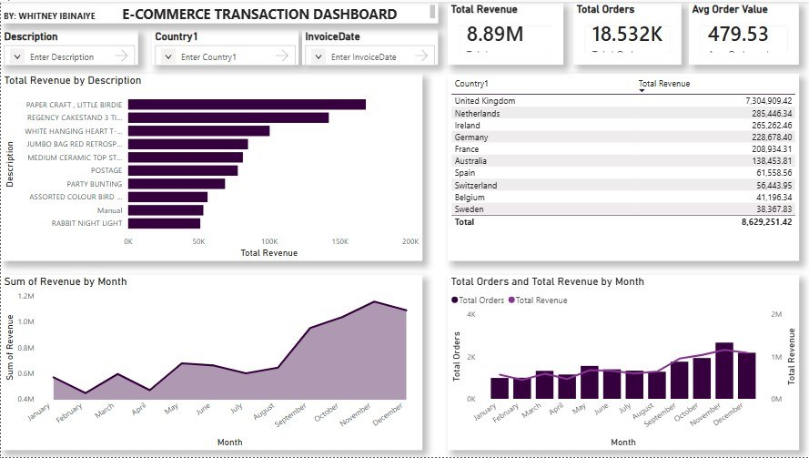

# E-Commerce-Transaction-Analysis
This project analyzes an e-commerce transaction dataset to uncover **sales trends, customer purchasing behavior, and product performance.

---

##  Project Summary

### Project Overview

This project analyzes an e-commerce transaction dataset to uncover **sales trends, customer purchasing behavior, and product performance**.

The analysis began with **data cleaning using SQL**, followed by dashboard development in **Microsoft Power BI** to create an interactive reporting solution for business decision-making.

The dashboard enables stakeholders to:

- Monitor key business metrics
- Identify high-performing products
- Analyze revenue by country
- Evaluate monthly sales performance
- Interactively filter and explore the data

---

## Business Problem

E-commerce businesses generate thousands of transactions daily, making it difficult to manually identify:

- Top-performing products
- High-revenue countries
- Monthly sales trends
- Customer purchasing patterns
- Overall business performance

Without an interactive dashboard, decision-makers may struggle to identify opportunities for growth and areas requiring improvement.

---

##  Objectives

The project aimed to:

- Clean and prepare transactional data using **SQL**
- Build an interactive **Power BI dashboard**
- Analyze total revenue and order performance
- Identify top-selling products
- Evaluate revenue generated by different countries
- Monitor monthly sales trends
- Provide interactive filtering for business users

---

##  Data Cleaning

The dataset was cleaned using **SQL** before visualization to improve data quality and accuracy.

### Cleaning Steps

- Removed duplicate records
- Handled missing values
- Replaced inconsistent country names
  - `RSA` → `South Africa`
  - `Eire` → `Ireland`
- Removed blank values in Revenue and Unit Price where appropriate
- Standardized text formatting using **Proper Case**
- Verified data types for:
  - Dates
  - Currency
  - Text fields
- Prepared the cleaned dataset for import into Power BI

---

##  Power BI Dashboard

The Power BI dashboard was designed to provide an interactive overview of e-commerce performance.

### KPI Cards

| KPI | Value |
|---|---:|
|  Total Revenue | **8.89M** |
|  Total Orders | **18.53K** |
|  Average Order Value | **479.53** |

### Interactive Slicers

The dashboard includes slicers that allow users to filter the analysis by:

- Product Description
- Country
- Invoice Date

### Visualizations

The dashboard contains the following visualizations:

1. **Revenue by Product Description**
   - Identifies products generating the highest revenue.

2. **Revenue by Country**
   - Compares revenue performance across different countries.

3. **Monthly Revenue Trend**
   - Shows how revenue changes throughout the year.

4. **Monthly Orders vs Revenue**
   - Compares order volume and revenue performance by month.

---

##  Key Insights

The analysis revealed several important findings:

### 1. Strong Overall Revenue Performance

The business generated approximately **8.89 million** in total revenue during the analysis period.

### 2. High Order Volume

More than **18,000 orders** were processed, demonstrating significant transaction activity.

### 3. Average Order Value

The average order value was approximately **479.53**, providing an overview of the average value generated per order.

### 4. United Kingdom as the Leading Market

The **United Kingdom generated the highest revenue by a significant margin**, making it the strongest market in the dataset.

### 5. High-Performing Products

Products such as **Paper Craft Little Birdie** and **Regency Cakestand** were among the highest revenue-generating products.

### 6. Seasonal Sales Pattern

Sales increased toward the end of the year, with **November and December** showing strong performance. This suggests the presence of seasonal demand.

---

## Recommendations

Based on the analysis, the following recommendations can be considered:

- Increase inventory for top-performing products during peak seasons.
- Strengthen marketing efforts in high-performing countries.
- Explore opportunities in lower-performing markets.
- Leverage seasonal sales trends to improve inventory planning.
- Promote high-margin products through targeted marketing campaigns.
- Continue monitoring monthly revenue and customer purchasing patterns to support strategic decision-making.

---

##  Tools & Technologies

The project was completed using:

- **SQL** — Data cleaning and preparation
- **Microsoft Power BI** — Dashboard development and visualization
- **Power Query** — Data transformation
- **DAX** — Measures and calculations

#   Dashboard Preview

